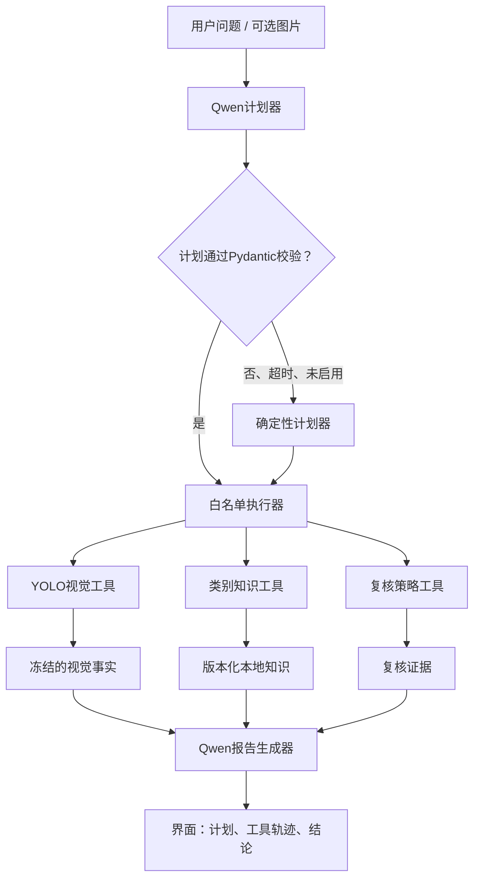

# 水域智巡智能体化升级设计（Phase 6 基线）

## 1. 为什么要升级

当前版本已经具备真实YOLO四模型集成、网页、API和Qwen解释能力，但运行顺序固定：先识别图片，再把同一份结构化结果交给Qwen改写。用户问题不会改变工具选择或执行顺序，因此它是可靠的“视觉识别系统 + 解释层”，但智能体的决策过程不明显。

本次升级不改变YOLO作为视觉事实来源的原则，而是让Qwen在受控边界内理解任务、提出可验证的计划，并让本地执行器调用多个工具完成任务。

## 2. 升级后的范围

### 2.1 首版支持的任务

| 任务意图 | 图片是否必需 | 工具序列 | 用户得到的内容 |
|---|---|---|---|
| `image_assessment` 图片异常识别 | 是 | `classify_water_image` → `compose_assessment` | 六分类、置信度、Top-3、证据边界、复核提示 |
| `patrol_report` 巡查报告/处置建议 | 是 | `classify_water_image` → `lookup_label_guidance` → `compose_report` | 疑似事件、建议核查项、非执法性处置建议、复核提示 |
| `result_reliability` 结果可靠性 | 是 | `classify_water_image` → `assess_review_need` → `compose_assessment` | 置信度、弱类风险、Top-3与人工复核理由 |
| `label_guidance` 类别含义/易混淆点 | 否 | `lookup_label_guidance` | 类别定义、区分提示、适用边界 |

### 2.2 明确不支持的能力

- 不输出目标框、污染物数量、坐标、面积或视频告警，因为当前官方标注和模型均不支持。
- 不输出违法认定、执法结论或处置决定；所有风险描述使用“疑似”“建议核实”。
- 不让LLM根据图片或语言自行写入分类标签。
- 不读取初赛测试集，不把交互图片、完整问题、密钥或提示词写入审计库。

## 3. 受控编排架构



### 3.1 Qwen计划器

赛事接口尚未证明支持原生 Function Calling，因此不依赖远程工具调用协议。计划器只要求Qwen输出一个小型JSON对象，由本地Pydantic模型校验。

示意结构：

```json
{
  "intent": "patrol_report",
  "tools": ["classify_water_image", "lookup_label_guidance", "compose_report"],
  "reason": "用户要求基于图片生成巡查建议"
}
```

规则：

1. `intent`只能是四个白名单枚举值。
2. `tools`只能来自预注册工具集，并由本地代码检查其顺序和图片前置条件。
3. Qwen不能提供文件路径、Shell命令、URL、任意参数或视觉标签。
4. JSON解析失败、违反契约、网络故障、超时或未启用Qwen时，转为本地确定性计划，并在轨迹中说明回退。

### 3.2 本地执行器

执行器是唯一能够调用工具的模块。它只接收已校验的`TaskPlan`，并以不可变的`EvidenceBundle`保存工具输出。

- `classify_water_image`：调用现有四折YOLO集成，唯一可写入`ClassificationResult.label`的工具。
- `lookup_label_guidance`：根据已确认的类别，返回项目内知识库的定义、常见混淆和建议核查点。
- `assess_review_need`：汇总置信度、Top-3间隔和当前强制复核类别（乱建、正常）后形成复核理由。
- `compose_assessment` / `compose_report`：Qwen可根据只读证据生成文本；失败时使用确定性中文模板。
- `write_audit_log`：仅记录任务类型、工具名称、状态、耗时、模型版本、类别与置信度；不记录原图、路径、完整问题或密钥。

## 4. 数据契约

将新增下列Pydantic对象：

| 对象 | 核心字段 | 关键限制 |
|---|---|---|
| `TaskIntent` | 四个枚举任务 | 不接受自由文本任务名 |
| `PlannedTool` | 工具名称 | 白名单枚举 |
| `TaskPlan` | intent、tools、reason、planner_mode | 工具顺序和图片条件由校验器约束 |
| `LabelGuidance` | label、definition、confusions、review_checks | 内容来自版本化本地资料 |
| `EvidenceBundle` | classification、guidance、review_assessment | 视觉分类对象不可变 |
| `AgentResponse` | answer、plan、evidence摘要、trace | 保持旧`AnalysisResponse`字段兼容 |

兼容策略：保留既有`AnalysisResponse.answer/result/trace`，新增字段均为可选或有默认值；既有API调用者不会因升级失效。

## 5. 知识库边界

首版知识库使用仓库内、人工审核的YAML/JSON文件，内容仅包括：

- 六类赛题标签的现有定义；
- 不同类别的视觉易混淆点；
- 非执法性的现场核实建议；
- 当前模型的已知薄弱类和复核策略。

暂不把未经核验的法律条文、网络材料或隐藏测试信息写入知识库。Qwen3-VL-Embedding和Reranker将列为第二阶段增强：先验证官方API契约、数据传输边界和批处理配额，再考虑用于知识检索或相似案例解释，且不能覆盖YOLO标签。

## 6. UI和API设计

### 6.1 网页

页面由一次性“上传 + 答案”调整为任务式对话，但不展示模型内部思维。用户能看到：

1. 智能体理解的任务，例如“生成巡查报告”；
2. 执行计划，例如“识别图片 → 查询类别知识 → 生成报告”；
3. 每个工具的成功/回退状态与耗时；
4. 分类事实、Top-3、复核建议；
5. 最终中文报告；
6. Qwen是否启用、是否实际成功调用。

### 6.2 API

- 保持`POST /api/v1/analyze`：图片和问题，默认任务为`image_assessment`。
- 增加可选`intent_hint`，只允许四个枚举值；它是用户偏好，不绕过计划校验。
- 增加文本咨询接口（类别说明），不接收本地路径或任意文件。
- `/health`增加计划器状态、知识库版本和实际视觉模式。

## 7. 质量门与验收用例

| 用例 | 预期 |
|---|---|
| 相同图片，“有什么异常？”与“写巡查报告” | YOLO分类完全相同；后者多调用知识/报告工具，文本内容不同 |
| Qwen正常 | 轨迹显示`plan_task`和报告生成成功 |
| Qwen超时或返回非JSON | 显示确定性计划回退；YOLO结果仍可返回 |
| Qwen试图输出不存在的工具或修改标签 | Pydantic/执行器拒绝该计划；类别保持YOLO结果 |
| 无图片问“乱堆是什么意思？” | 只调用类别知识工具，不调用YOLO |
| 正常或乱建标签 | 无论高置信度，均保留人工复核提示 |
| 批量生成赛事JSON | 与升级前独立链一致，不调用Qwen |

## 8. 实施顺序

1. 新增Schema、任务计划校验、受控工具注册表与确定性计划器。
2. 增加项目内知识库和类别知识工具。
3. 扩展Qwen适配器：计划生成与报告生成分离，均有安全解析和降级。
4. 重构`WaterAnalysisAgent`为“计划 → 执行 → 证据 → 报告”链，同时保留旧响应字段。
5. 更新FastAPI与Gradio，显示任务计划和工具证据。
6. 编写单元、集成和真实Qwen端到端测试；回归批量推理链。
7. 更新演示文档和设计方案，再进入单独的模型精度优化阶段。

