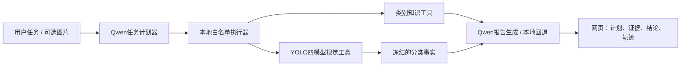
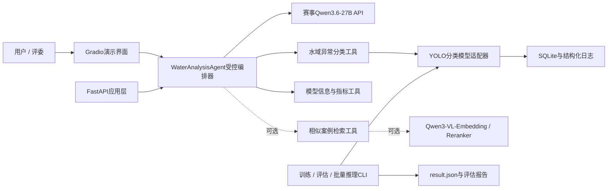

# 水域综合异常识别智能体技术架构（10天交付版）

> **当前实际实现（2026-08-21）**：项目已从“固定YOLO调用 + Qwen短解释”升级为受控多工具智能体。Qwen生成并不直接执行的结构化任务计划；本地白名单执行器按计划调用YOLO识别、类别知识、复核策略和报告工具。YOLO的`ClassificationResult`为不可变视觉事实，Qwen不能修改标签。详细协议见`AGENT_UPGRADE_DESIGN.md`；下文中与此不一致的早期候选/规划表述以本说明为准。



## 1. 设计目标

在约10天内交付一套同时满足以下目标的作品：

1. 可打榜：稳定批量生成赛事要求的 `result.json`。
2. 可演示：用户上传图片并自然语言提问，Agent自主调用视觉模型工具。
3. 可解释：呈现类别、置信度、人工复核建议、工具调用和耗时。
4. 可迭代：训练配置、模型权重、指标和榜单提交可追溯。
5. 可迁移：初赛本机运行，决赛可迁移至赛事国产平台。

## 2. 核心原则

- 一套视觉模型，两条执行链：交互链使用Agent；批量评测链绕过LLM直接推理。
- 比赛标签以视觉工具输出为准，LLM负责意图、编排和解释，不随意改写类别。
- 核心链路只依赖Qwen3.6-27B对话API；Embedding和Reranker作为功能开关控制的增强模块。
- 不引入微服务、Redis、Celery、React或独立向量数据库。
- 先打通纵向切片，再训练最终模型；不等待所有模块完成后才集成。

## 3. 总体架构



## 4. 两条执行链

### 4.1 交互演示链

1. 用户在Gradio上传图片并输入问题。
2. FastAPI完成格式、大小、解码和路径安全检查，生成内部图片ID。
3. 单图分析意图进入 `WaterAnalysisAgent`；该受控工作流调用 `classify_water_image` 工具。
4. 工具通过视觉模型适配器调用YOLO分类模型。
5. 返回固定结构：类别、置信度、Top-K概率、耗时、模型版本、是否建议复核。
6. Agent只能基于工具结果生成解释，不得创造第七种类别或修改工具标签。
7. UI展示最终回答和高层动作轨迹，例如“已校验图片 → 已调用分类工具 → 已生成建议”；不展示模型隐式思维过程。

### 4.2 赛事批量评测链

1. 用户在自己的终端运行CLI并指定官方测试目录；Agent开发过程不打开、枚举或检查该目录。
2. 直接调用视觉模型/多折模型集合，不经过大模型API。
3. 按输入顺序生成 `filename`、`width`、`height`、`label`。
4. 本地校验条数、文件名、字段、标签枚举、重复项和JSON可解析性。
5. 输出 `result/result.json` 并记录模型版本、配置摘要和生成时间；程序不生成测试图片预览。

批量链绕过LLM，避免API限流、费用、网络和生成随机性影响打榜结果。

## 5. 技术栈冻结

| 层次 | 选型 | 用途与理由 |
|---|---|---|
| 语言 | Python 3.11/3.12 | PyTorch、Ultralytics、LangChain和Web生态兼容性较稳 |
| 深度学习 | PyTorch + torchvision | 训练、推理、自定义采样与预处理 |
| 视觉模型 | Ultralytics YOLO Classify | 与官方整图单标签任务一致，训练和导出速度快 |
| 主模型 | 四折 `yolo26n-cls` 等权概率集成 | 已在8GB显存上完成训练和现场性能验收，兼顾长尾稳健性与速度 |
| Agent | 自研 `WaterAnalysisAgent` 受控编排器 | 单图意图确定性调用视觉工具，记录轨迹，并在Qwen不可用时安全降级 |
| 大模型 | 赛事 `qwen3.6-27b` API | 国产开源、赛事提供；只负责对话与工具编排 |
| 可选检索 | Qwen3-VL-Embedding-8B + Reranker-8B | 低置信度相似案例检索；核心链稳定后再启用 |
| API | FastAPI + Uvicorn | 上传、单图推理、健康检查、指标查询 |
| UI | Gradio Blocks | 快速实现图片、对话、分类概率和调用轨迹展示 |
| 数据校验 | Pydantic v2 | API和工具输入输出契约 |
| 数据处理 | NumPy、Pillow、OpenCV、scikit-learn | 图像处理、分层划分、评估和概率融合 |
| 持久化 | SQLite（标准库） | 请求、工具调用、模型版本和提交记录；无需额外服务 |
| 配置 | pydantic-settings + YAML | 密钥从环境读取，训练/推理配置写入YAML |
| 测试 | pytest + pytest-asyncio | 单元、契约、API与Agent模拟测试 |
| 质量 | Ruff | 快速格式和静态检查 |
| 模型记录 | CSV/JSON + TensorBoard | 轻量、可复制进设计报告，不引入MLflow服务 |
| 打包 | `pyproject.toml` + `requirements-lock.txt` | 锁定依赖，同时兼顾本机和决赛平台安装 |

依赖版本在创建项目环境时根据Python、CUDA和赛事平台兼容性精确锁定，不使用浮动最新版。

## 6. 视觉模型方案

### 6.1 任务定义

- 单图单标签六分类：乱采、乱建、乱堆、乱占、有漂浮物、正常。
- 不输出伪造检测框。
- 可选Grad-CAM仅作为解释热力图，不进入比赛标签计算。

### 6.2 输入预处理

- 使用保持长宽比的Resize/Letterbox，默认输入尺寸候选为640。
- 禁用会丢失关键边缘内容的默认中心裁剪。
- 标准化和颜色空间由训练、验证、推理共用同一配置。
- 训练增强保持克制：水平翻转、亮度/对比度、轻微模糊、压缩噪声、有限尺度变化。
- 默认禁止垂直翻转和重度随机裁剪，避免破坏水面/岸线语义和小目标。

### 6.3 长尾策略

- 首先记录“全预测有漂浮物”的多数类基线。
- 使用4折分层交叉验证；最少类仅4张，因此不超过4折。
- 每折训练独立模型，测试时平均概率后取最终类别。
- 使用按有效样本数计算并封顶的类别权重，避免简单倒数权重导致训练不稳定。
- 可选WeightedRandomSampler；不能同时把重采样和极端类别权重全部拉满。
- 主指标：Macro-F1、Balanced Accuracy、每类Recall；同时记录Accuracy。
- 保存混淆矩阵和每类概率分布，用于设计书的迭代效果章节。

### 6.4 模型选择与回退

- 主方案：`yolo26s-cls`，输入640，AMP混合精度，批量大小根据8GB显存实测。
- 显存不足时依次回退：减小batch → 梯度累积 → `yolo26n-cls`。
- 若YOLO分类对少数类明显失效，模型适配器允许替换为timm分类器；不改Agent、API和UI。
- 不在第一轮同时开发目标检测、分割和多种大型骨干网络。

## 7. Agent设计

### 7.1 Agent职责

- 理解用户是否要求图片分析、模型信息、批量结果或帮助。
- 校验调用工具所需参数是否齐全。
- 选择且只选择已注册的安全工具。
- 将工具返回的结构化结果转换为面向普通用户的解释。
- 低置信度时明确提示人工复核。
- 工具失败时解释失败原因和可采取的下一步。

### 7.2 工具清单

| 工具 | 输入 | 输出 |
|---|---|---|
| `classify_water_image` | 内部图片ID | 类别、概率、耗时、模型版本、复核标志 |
| `get_model_card` | 无或模型ID | 模型、数据、类别、指标、许可证摘要 |
| `validate_submission` | 内部结果文件ID | 条数、字段、标签、重复项、错误列表 |
| `get_recent_metrics` | 模型ID | Macro-F1、每类指标、混淆矩阵路径 |
| `retrieve_similar_cases` | 内部图片ID、Top-K | 可选相似案例与相似度，不直接覆盖分类标签 |

工具不接受用户提供的任意本地文件路径或命令，只接受服务端生成的资源ID。

### 7.3 Qwen接口适配

- 通过 `QwenChatProvider` 隔离赛事API的base URL、鉴权、模型名和请求字段；默认OpenAI兼容基地址为 `https://www.zsjsry.top/v1`，模型名为 `qwen3.6-27b`。
- 官方示例只证明普通对话，未证明Function Calling。首版分析端点采用可审计的受控工具编排，再将结构化结果交给Qwen解释；Qwen不得修改视觉标签。
- API密钥只从环境变量读取，不写入代码、日志或提交包。
- 也允许从用户明确配置的本地密钥文件读取；不得复制、打印、记录文件内容。
- 为Agent测试提供 `FakeQwenProvider`，无API时仍可验证工具链和UI。

## 8. Embedding与Reranker增强

这两个API不进入首日核心链路。只有核心验收全部通过后才启用：

1. 用Qwen3-VL-Embedding生成训练图像向量并保存为本地NPZ文件。
2. 对低置信度图片检索Top-K相似已标注案例；1,144条数据直接用NumPy余弦相似度，不引入向量数据库。
3. 用Qwen3-VL-Reranker对候选案例或类别描述重排。
4. 结果仅作为Agent解释或融合实验特征，不能未经验证直接覆盖YOLO标签。

启用条件：API协议明确、批量额度足够、数据传输符合赛事规则、核心打榜链已稳定。

## 9. API接口

| 方法 | 路径 | 说明 |
|---|---|---|
| GET | `/health` | 服务、GPU、模型和Qwen API状态 |
| POST | `/api/v1/analyze` | 图片+自然语言提示，返回Agent回答和工具轨迹 |
| POST | `/api/v1/classify` | 直接分类接口，用于调试和降级 |
| GET | `/api/v1/models/current` | 当前模型版本与指标摘要 |
| POST | `/api/v1/submissions/validate` | 校验上传或生成的结果JSON |

批量训练和比赛推理不通过HTTP触发，使用CLI：

```text
python -m water_agent.cli prepare-data
python -m water_agent.cli train --config configs/train.yaml
python -m water_agent.cli evaluate --run-id ...
python -m water_agent.cli predict-batch --config configs/infer.yaml
python -m water_agent.cli validate-submission result/result.json
```

## 10. 项目目录

```text
水域综合异常识别/
├─ pyproject.toml
├─ requirements-lock.txt
├─ .env.example
├─ configs/
│  ├─ app.yaml
│  ├─ train.yaml
│  └─ infer.yaml
├─ src/water_agent/
│  ├─ config.py
│  ├─ schemas.py
│  ├─ cli.py
│  ├─ agent/
│  │  ├─ water_agent.py
│  │  ├─ prompts.py
│  │  └─ qwen_provider.py
│  ├─ tools/
│  │  ├─ classify.py
│  │  ├─ model_card.py
│  │  ├─ submission.py
│  │  └─ retrieval.py
│  ├─ vision/
│  │  ├─ dataset.py
│  │  ├─ transforms.py
│  │  ├─ model.py
│  │  ├─ train.py
│  │  ├─ evaluate.py
│  │  └─ ensemble.py
│  ├─ api/
│  │  └─ main.py
│  ├─ ui/
│  │  └─ app.py
│  └─ storage/
│     ├─ database.py
│     └─ repositories.py
├─ scripts/
├─ tests/
│  ├─ unit/
│  ├─ integration/
│  └─ fixtures/
├─ artifacts/
│  ├─ models/
│  ├─ metrics/
│  └─ logs/
├─ design/
└─ result/
```

赛事原始数据目录不改名、不移动；数据适配器通过配置引用。衍生划分清单写入 `artifacts/`，不污染原始资料。

## 11. SQLite最小数据模型

- `model_versions`：模型ID、权重路径、配置哈希、训练时间、指标。
- `requests`：请求ID、输入类型、状态、总耗时、创建时间。
- `tool_calls`：请求ID、工具名、状态、耗时、错误码。
- `predictions`：请求ID、模型ID、类别、置信度、复核标志。
- `submissions`：文件哈希、模型ID、生成时间、本地校验、榜单成绩备注。

不保存无必要的原图副本；临时上传文件按任务结束或设定期限清理。

## 12. 安全与稳健性

- 限制上传扩展名、MIME、文件大小和像素总量，并实际解码验证。
- 使用随机资源ID和受控工作目录，拒绝路径穿越。
- Qwen只接收必要文本和工具结果；是否向官方多模态API传图必须单独配置。
- API密钥和平台地址不进入版本库或赛事结果日志。
- 单个坏图不使批量任务整体崩溃；错误样本进入明确报告。
- Agent不能调用任意Python、Shell、浏览器或文件系统工具。
- 批量结果生成后强制运行JSON校验门。

## 13. 测试策略

### 单元测试

- 六类枚举和中英文映射。
- 图片校验、路径安全和宽高读取。
- 分类结果到赛事JSON的转换。
- 类别权重、概率融合和低置信度策略。
- Qwen响应和工具调用解析。

### 集成测试

- Mock Qwen API → Agent → Fake视觉模型 → 最终回答。
- FastAPI上传 → 工具调用 → SQLite日志。
- 小规模批量预测 → JSON校验。
- Qwen API不可用时，直接分类和批量链仍可运行。

### 模型验收

- 4折结果、Macro-F1、Balanced Accuracy、每类Recall和混淆矩阵齐全。
- 与多数类基线对比。
- 记录GPU显存、单图模型耗时和端到端耗时。
- 每个最终权重都能映射到配置、代码版本和数据划分。

## 14. 10天压缩计划

| 天数 | 交付结果 | 退出条件 |
|---|---|---|
| D1 | 项目骨架、配置、Schema、Fake模型、FastAPI/Gradio纵向切片 | 上传一张非赛事示例图，Agent可调用Fake工具并展示轨迹 |
| D2 | 数据适配、分层划分、冒烟训练、JSON转换 | 获得授权后读取训练集；YOLO Nano完成小规模训练/推理 |
| D3-D4 | YOLO主模型、长尾策略、4折训练 | 每折权重和指标可复现，至少优于多数类基线的宏指标 |
| D5 | 4折融合、批量推理、提交校验 | 生成结构完全合规的候选`result.json` |
| D6 | Qwen3.6 API、受控Agent工具接入 | 真API完成单图问答，失败时能正确降级 |
| D7 | Gradio演示、日志、模型卡 | 可现场演示工具调用、置信度和耗时 |
| D8 | Embedding/Reranker增强或模型定向优化 | 仅在核心链全绿时启用；否则用于修复主链问题 |
| D9 | 端到端测试、运行演示录制、方案文档 | 干净环境按说明可运行，材料覆盖官方模板章节 |
| D10 | 最终候选提交、压缩包检查、缓冲 | `code/`、`design/`、`result/`完整且校验通过 |

## 15. 明确不做

- 首轮不训练目标检测或分割模型。
- 不开发React前端、移动端或复杂权限系统。
- 不用Celery、Redis、Kafka、Kubernetes或微服务。
- 不把训练放进Web请求或后台线程。
- 不强行使用Embedding/Reranker来证明“用了更多模型”。
- 不在评分规则未知时进行大量盲目刷榜；每日5次额度应有实验记录和假设。

## 16. 开工门槛

已满足：需求基线、赛事合规、主架构、技术栈、10天计划。

仍需用户明确授权：

1. 允许只读访问“训练集”用于数据适配、训练和验证。
2. “初赛测试集”禁止Agent访问；最终由用户运行项目提供的批量预测和校验CLI。
3. 对话API基地址和示例已提供；Embedding/Reranker的具体请求格式仍需补充或通过官方文档确认。
